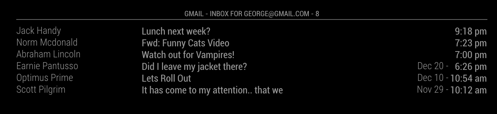

# MMM-GmailFeed
A module for the MagicMirror project which creates a table filled with the current list of unread gmail messages.  This module uses the gmail RSS feed instead of IMAP.

## Example 1
End result:



Configuration:

```javascript
{
	module: 'MMM-GmailFeed',
	position: 'bottom_bar',
	config: {
		username: 'yourname@gmail.com',
		password: 'yourpassword',
		updateInterval: 60000,
		maxEmails: 5,
		maxSubjectLength: 38,
		maxFromLength: 15,
		playSound: true
	}
}
```

## Installation
````
git clone https://github.com/shaneapowell/MMM-GmailFeed.git
cd MMM-GmailFeed
npm install
````

## Config Options
| **Option** | **Default** | **Description** |
| --- | --- | --- |
| username | "" | Your full gmail username.  This can be your coprorate email if you are using a gsuite account |
| password | null | Your gmail password. If you are using 2 factor auth, you'll need to generate a unique "App Password". Go to your google account settings page, look in the "security" section on the left menu. You should find where to add an App Password there. |
| updateInterval | 60000 | milliseconds between updates |
| maxEmails | 5 | The maximum number of emails to show in the table. The table header will still show the full list of unread emails. |
| maxSubjectLength | 40 | Maximum number of characters to show in the subject column |
| maxFromLength | 15 | Maximum number of characters to show in the from column |
| playSound | true | Play a notification chime when a new email arrives |

## Chrome Startup Tricks
I run my MagicMirror on an ancient rpi-1. It works, but it's not fast. I have it configured to auto-login my normal user into non GUI mode.  I did it this way to avoid using any window manager or login manager of any sort.  My rpi has to little ram for that.   At the end of my users .bashrc file I added..
```
if [[ -z $DISPLAY ]] && [[ $(tty) = /dev/tty1 ]]; then exec startx; fi
```
I then created a .xinitrc file in my home directory with the following...
```
xset s off
xset -dpms
xset s noblank
unclutter -root &

sed -i 's/"exited_cleanly":false/"exited_cleanly":true/' ~/.config/chromium/Default/Preferences
sed -i 's/"exit_type":"Crashed"/"exit_type":"Normal"/' ~/.config/chromium/Default/Preferences
chromium-browser --alsa-output-device=default --noerrordialogs --disable-infobars --app=http://10.0.0.2:8999
```
The ```-alsa-output-device``` was necessary to force chrome to use alsa instead of PulseAudio.
The ```--app=xxxx``` fired it up into a kind of kiosk mode
The ```--autoplay-policy=no-user-gesture-required``` was needed to allow sound to function without having to ever touch the mouse or keybaord.

Another thing I did was turn off the swap partition.  Chrome will take up all the ram it can get, and more!  I found that after 24 hours, my swap partition was 100% full.  Disabling the swap partition didn't negativly affect this already slow machine. Chrome works just fine without having access to ALL THE RAM!!
```
sudo dphys-swapfile swapoff
sudo systemctl disable dphys-swapfile
```

Lastly, I set the alsamixer to a good volume, and set it to restore on boot.
```
alsamixer
sudo alsactl store
```

## Planned Upgrades/Updates
* 2 Startup Modes. Tabular(default) or Notification Icon.
  * Tabular mode will be the default, were a short list of the current unread emails are listed.
  * Notification mode will be a small(ish) gmail icon, with a counter value on it.
